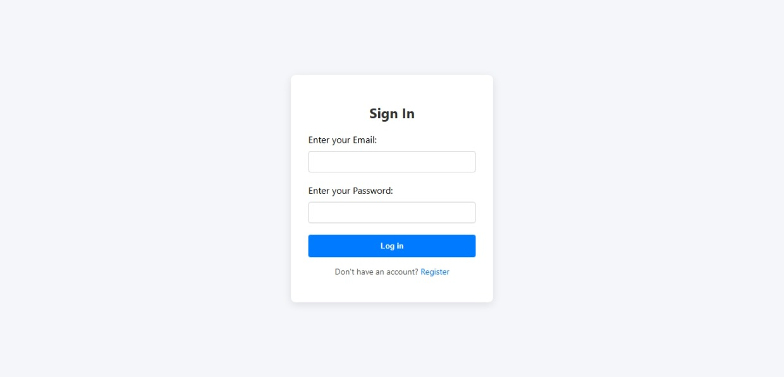
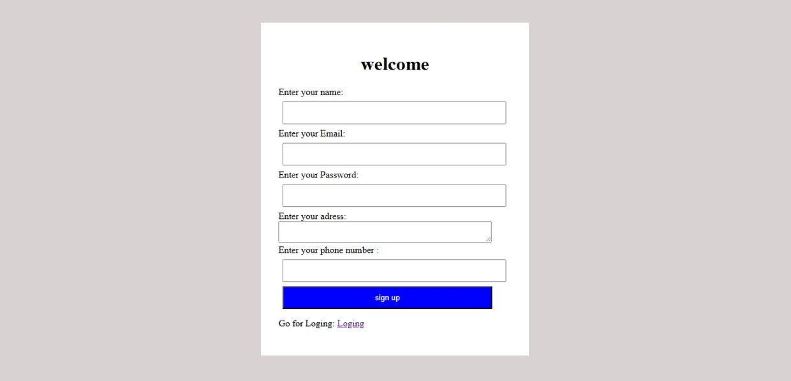
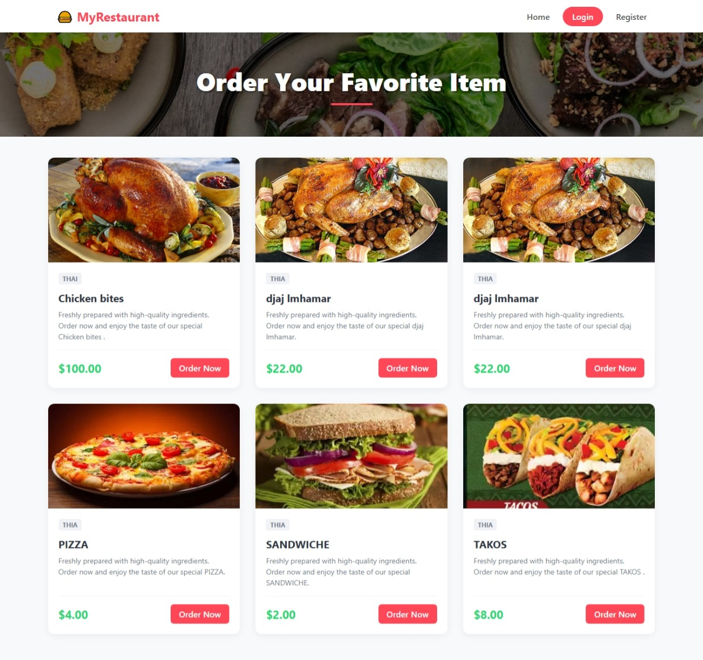
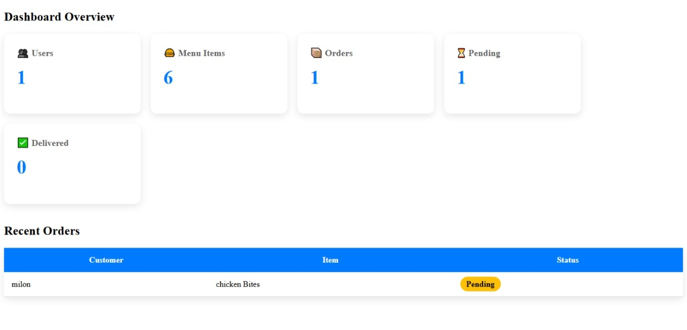
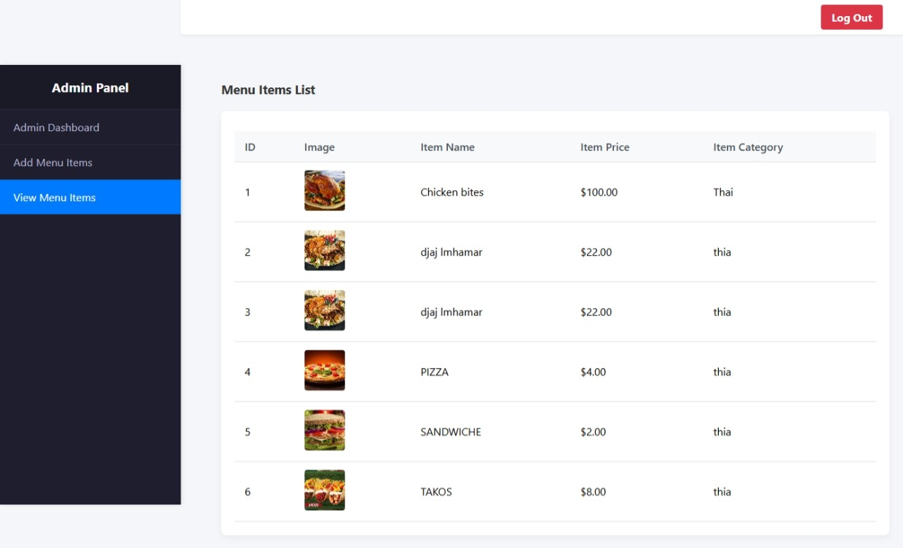
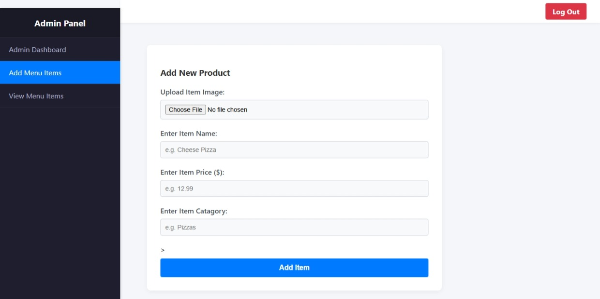
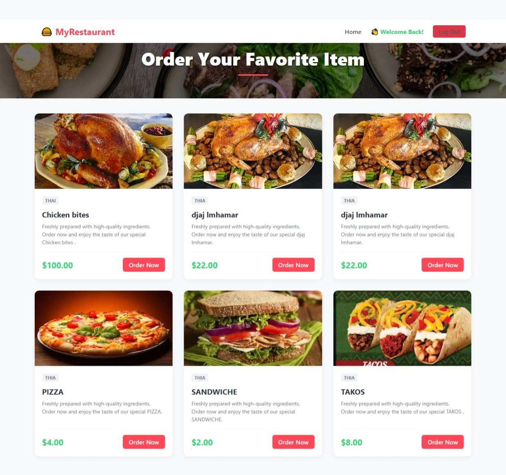

# 🍽️ Restaurant Management System

<<<<<<< HEAD
=======
<p align="center">


</p>

>>>>>>> 3228290d72d373f5d39b1c1cda2180cd5e6b40b8
A simple Restaurant Management System built with PHP, MySQL, HTML, CSS, and JavaScript.

## 📌 Overview

This project allows restaurant administrators to manage menu items and customer orders through an easy-to-use dashboard.

It was developed as a learning project to improve my Full Stack Web Development skills.

---

## ✨ Features

- 👤 User Login System
- 🔐 Admin Dashboard
- 🍔 Add Menu Items
- ✏️ Edit Menu Items
- ❌ Delete Menu Items
- 📋 View All Menu Items
- 🛒 Manage Customer Orders
- 📦 Update Order Status (Pending / Delivered)
- 📊 Dashboard Statistics

---

## 🛠️ Technologies Used

- HTML5
- CSS3
- JavaScript
- PHP
- MySQL
- Bootstrap

---

## 📂 Project Structure

```
Restaurant-Management-System/
│
├── admin/
├── css/
├── js/
├── images/
├── database/
│   └── restaurant_db.sql
├── index.php
├── login.php
├── logout.php
└── README.md
```

---

## ⚙️ Installation

1. Clone the repository

```bash
git clone https://github.com/ILYAS-DAOUI/Restaurant-Management-System.git
```

2. Move the project into the `htdocs` folder (XAMPP).

3. Import the database:

- Open phpMyAdmin
- Create a database named:

```
restaurant_db
```

- Import:

```
restaurant_db.sql
```

4. Start Apache and MySQL.

5. Open:

```
http://localhost/Restaurant-Management-System
```

---

## 📸 Screenshots

## 🔐 Login Page

<p align="center">
  
</p>

---

## 📝 Register Page

<p align="center">
  
</p>

---

## 🏠 Home Page

<p align="center">
  
</p>

---

## 📊 Admin Dashboard

<p align="center">
  
</p>

---

## 🍔 Menu Management

<p align="center">
  
</p>

---

## ➕ Add Menu Item

<p align="center">
  
</p>

---

## 📦 Orders Management

<p align="center">
  
</p>


=======

>>>>>>> 3228290d72d373f5d39b1c1cda2180cd5e6b40b8
## 🚀 Future Improvements

- Customer Panel
- Shopping Cart
- Online Payment
- Search Menu
- Responsive Design
- Sales Reports

---

## 👨‍💻 Author

**Ilyas Daoui**

Software Development Student 🇲🇦

GitHub:
https://github.com/ILYAS-DAOUI

LinkedIn:
https://www.linkedin.com/in/ilyas-daoui-58b10b385/

Instagram:
https://www.instagram.com/ilyas.daoui_/

---

⭐ If you like this project, don't forget to give it a Star!
